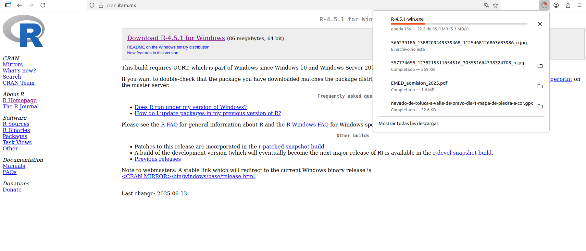

## Módulo 1. Introducción a R

### Creando el ambiente de trabajo con R.
#### El proyecto que le da soporte y descarga

[https://posit.co/](https://posit.co/)

 

#### Bajando el archivo ejecutable
 

#### Aceptar la licencia
 

##### Aceptando las opciones por omisión
 

### Ejecutar R

<TABLE style="margin: 10 auto;">
    <TR>
    <TD> 
       
    </TD>
    <TD> 
       
    </TD>
    </TR>
</TABLE>

### Usando la consola de R
 

### RStudio. Es un IDE

R al igual que otros lenguajes de programación se desarrolla o se extiende
a través de funciones escritas por el usuario. Un entorno de desarrollo
integrado o entorno de desarrollo interactivo, tal como RStudio, esta
diseñado para facilitar este trabajo. Diferente a otros paquetes de software
estadı́stico en que en la interfaz gráfica es el principal canal de interacción
entre el usuario y el programa en R se interactua principalmente con la
linea de comandos.

#### RStudio. IDE disponible en línea 
 

#### RStudio selección de la versión a instalar
 

#### RStudio selección por sistema operativo
 

#### RStudio ambiente de trabajo
 

#### RStudio ventanas del ambiente de trabajo
RStudio consta de 4 ventanas en su ambiente de trabajo:

1. Ventana 1. Editor de sintáxis: es el lugar donde se edita la sintaxis para posteriormente ejecutarla. Es necesario usar el botón de "Run" para que las líneas se ejecuten.

2. Ventana 2. Es el "entorno de trabajo" del programa, ahí se muestran el conjunto de datos y los objetos ( resultados, variantes, gráficos, etc) que se almacenan al ejecutar diferentes análisis.

3. Ventana 3. Tiene varias sub pestañas:

  - Files. Permite ver el historial de archivos trabajados en el programa
  - Plots. Permite visualizar los gráficos que se generan
  - Packages. Permite ver los paquetes descargados y guardados en el disco duro así como gestionar su instalación o actualización.
  - help. Permite acceder al CRAN -siempre que se cuente con conexión a internet-, página oficial del software que ofrece diferentes recursos para el programa: manuales para el usuario, cursos on line, información general, descarga de paquetes, información de los paquetes instalados, etc. Esta última pestaña es bastante útil: empleando el motor de búsqueda se accede de manera rápida a manuales de uso de diferentes paquetes instalados en la computadora (sin conexión a internet).
  - Viewer. Muestra los resultados al construir reportes mediante funcionalidades tipo "rmarkdown".
  
4. Ventana 4. La consola. Corresponde a lo que sería el programa de R en su versión básica. Allí el software ejecuta las operaciones realizadas desde el editor de sintáxis.

### Paquetes en R  

_Un paquete (package) es una colección de funciones, datos y código R que se almacenan en una carpeta conforme a una estructura bien definida, fácilmente accesible para R._
 
Los paquetes los podemos encontrar en: <https://r-pkgs.org/>

<TABLE style="margin: 0 auto;">
    <TR>
    <TD> 
       
    </TD>
    <TD> 
       
    </TD>
    </TR>
</TABLE>
