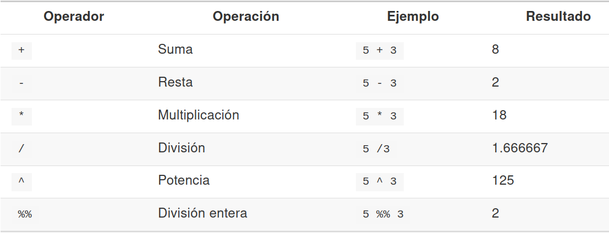
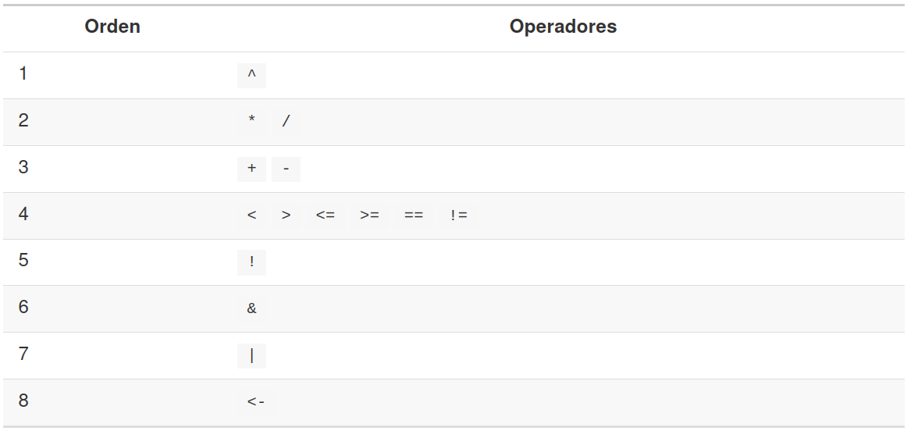
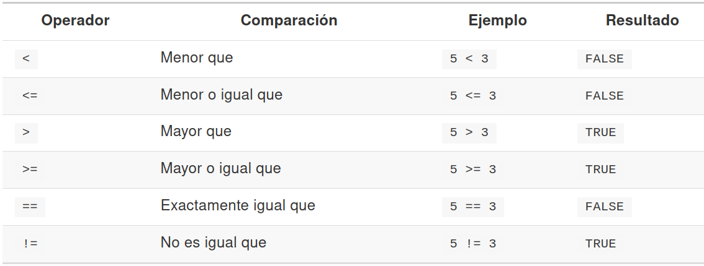

## Módulo 2: Operaciones y funciones básicas con R

##
[Así va el scrip para este módulo...](../src/modulo2.R)
##
En R contamos con varias funciones de ayuda que nos permiten entrar a la documentación de las funciones, bases de datos y otros objetos ya sean parte de la instalación estándar como de los paquetes extras, entre ellas podemos enlistar las siguientes: 

### Funciones de ayuda
<pre><code>
help() 
</code></pre>

R tiene documentación integrada en el entorno de desarrollo. Para obtener ayuda de una función puedes usar las funciones 
<pre><code>
help o ?
</code></pre>

##

##
Se usa como:
<pre><code>
?nombre_de_funcion, help(nombre_de_funcion)
</code></pre>

Ejemplo: usando la distribución normal

<pre><code>
  help(rnorm)
  ?rnorm
</code></pre>

Esto cargará una página de ayuda en RStudio (o como texto sin formato en R por sí mismo).

##

Cada página de ayuda se divide en secciones:

  - Descripción: una descripción extendida de lo que hace la función.
  - Uso: los argumentos de la función y sus valores predeterminados.
  - Argumentos: una explicación de los datos que espera cada argumento.
  - Detalles: cualquier detalle importante a tener en cuenta
  - Valor: los datos que regresa la función
  - Ver también: cualquier función relacionada que pueda serte útil.
  - Ejemplos: algunos ejemplos de cómo usar la función

## Más ayuda

Favor de teclear
<pre><code>
 help.start()
</code></pre>

Despliega una versión de la documentación en línea de R, con ligas a las versiones de R instaladas localmente, manuales de R y una lista de los paquetes actualmente instalados.

## Los directorios de trabajo

Un directorio de trabajo es el directorio desde el cual **R** va a leer los archivos( de datos, imágenes) o a guardar archivos (si el código lo dice).
<pre><code>
getwd() # para conocer el directorio de trabajo
setwd("C:\otro_directorio") #para modificar el directorio de trabajo
</code></pre>

Ejemplos (en ambos ejemplos se asume que existen dichos subdirectorios):
<pre><code>
#en Windows
setwd("C:/Users/UsuariO/Desktop/cursoRParaLasCienciasSociales/sesion1")
#en Ubuntu 
setwd("~/Documents/cursoDeRParaLasCienciasSociales")
</code></pre>

## Qué es un "script" (un archivo de código fuente)?

**Un archivo de código fuente en R es un archivo que contiene instrucciones que sólo R sabe identificar, para luego interpretarlas y generar salidas en tiempo de ejecución**

Es importante escribir las instrucciones de nuestro algoritmo solución en un archivo que quede guardado en la computadora, de tal manera que pueda reusarse en el futuro con los mismos datos o con datos diferentes.
Y no volver a reconstruir todo cada vez que necesitemos hacer una análisis.

- Los scripts en *R* tienen terminación **.R**

## Comentarios
**Los comentarios son líneas, inmersas en el código fuente, que son ignoradas por el *intérprete de R*, por lo que pueden contener cualquier información, en cualquier formato**

- La mayoría de veces las instrucciones que usamos, así como el uso de las funciones y los argumentos que necesitan, no son fáciles de recordar. 

- Insertar comentarios a nuestro código es importante porque nos ayudarán a la tarea de no volver a rehacer la solución cada vez. 

- Además que es uno de los mecanismos de comunicación con nosotros mismos (en el futuro) y con otros desarrolladores.

## Operaciones aritméticas
<pre><code>
15 + 3
[1] 45
</code></pre>

El **[1]** al inicio de la línea resultado nos dice el número de la observación en la que está clasificada la salida. Este número toma relevancia cuando el número de líneas de código incrementa.

<pre><code>
#Qué pasará con esta expresión aritmética?:
4 + "tres"
## Error in 4 + "tres": argumento no-numérico para operador binario
</code></pre>

## Operadores aritméticos
 

La precedencia de operadores es la usual, de tal manera que la expresión:
**2 + 3 * 4**

- Se interpreta como: **2 + (3 * 4) = 14** 
- Y **NO** como **(2 + 3) * 4 = 20**
- Recomendación: usar siempre paréntesis bien anidados.

## Precedencia de operadores
 

## La división entera (o módulo)
Es la división de un número entre otro, pero en lugar de devolver el cociente, nos devuelve el residuo.

Ejemplo:
<pre><code>
8 %% 4
## [1] 0
9 %% 2
## [1] 1
</code></pre>

## Operadores relacionales
 
  
Comparaciones entre cadenas. Lo hace por el orden alfabético
Ejemplo:
  <pre><code>
"cepillo" > "balón"
## [1] TRUE
</code></pre>

## Funciones matemáticas
  Hay una gran cantidades de funciones matemáticas predefinidas, sólo hay que saber que argumentos necesitan para trabajar

<pre><code>
log(1)              # logarithm to base e
## [1] 0
log10(1)            # logarithm to base 10
## [1] 0
exp(1)              # natural antilog
## [1] 2.718282
sqrt(4)             # square root
## [1] 2
4^2                   # 4 to the power of 2
## [1] 16
pi                    # not a function but useful
## [1] 3.141593
</code></pre>

## Objetos en el ambiente de ejecución de R
  - Los *objetos* son espacios en la memoria que guardan información que puede accederse y guardarse de manera específica para luego hacer procedimientos estadísticos y gráficos, entre otros. 

- En R existen: variables, constantes, vectores, matrices, arreglos, dataframes(marco de datos), listas, etc.

## Cómo crear un objeto
Necesitamos un nombre, un valor y el operador de asignación para asignarle el valor

Ejemplo:
<pre><code>
obj <- 48
</code></pre>
  
  • Cuando los objetos se crean, se guardan en la memoria asociada a R y se pueden monitorear desde el entorno gráfico de R.

<pre><code>
obj2 <- "R is cool"
obj2 <- R is cool #error
obj2 <- R is cool
Error: unexpected symbol in "my_obj2 <- R is"
</code></pre>
  
  ## Más operaciones con objetos
  para reasignar el valor de algún objeto, simplemente se vuelve asociar un valor nuevo con el operador de asignación 
<pre><code>
  obj2 <- 2048
</code></pre>
  
  -Hay que notar que en el ambiente de ejecución se actualiza también el tipo de objeto para "obj2"

-También se pueden hacer operaciones usando a los objetos almacenados previamente
<pre><code>
x <- obj1 + obj2
x
</code></pre>
  
  Errores con objetos no definidos
<pre><code>
obj <- 98
obj4 <- my_obj + no_obj
Error: object 'no_obj' not found
</code></pre>
  
  ## Objetos en tiempo de ejecución con funciones
  
  - Para ver qué objetos se encuentran activos en la memoria se usa (ambas funciones son equivalentes)
<pre><code>
objects()
ls()
</code></pre>
  
  ## Lista de los paquetes adjuntos y de algunos objetos (dataframes)
  
  <pre><code>
  search()
</code></pre>
  
  - la salida muestra un vector que empieza con las variables de ambiente globales, e incluye a los paquetes base.

## Borrando objetos de la memoria 
- Es necesario cuidar el espacio en memoria, sobre todo para proyectos grandes o manejo de datos masivos.
- Cuando un objeto ya no va a ocuparse en ejecución, lo mejor es borrarlo.
<pre><code>
  rm()
</code></pre>
  
  Se usa:
  <pre><code>
  rm(nombreDelObjeto)
</code></pre>
  
  ## Usando paquetes
  
  Para usar un paquete se usa la función
<pre><code>
  library(elNombreDelPaquete)
</code></pre>
  
  Ejemplo:
  <pre><code>
  library(dplyr)
</code></pre>
  
  Nota: *dplyr* es un paquete que permite la manipulación de archivos de datos (de tipo columnas-renglones) para poder hacer filtros, o elegir algunas columnas, etc
[https://swcarpentry.github.io/r-novice-gapminder-es/13-dplyr/](https://swcarpentry.github.io/r-novice-gapminder-es/13-dplyr/).

## Instalando paquetes
<pre><code>
  install.packages(nombreDelPaquete)
</code></pre>
  
  Ejemplo:
  <pre><code>
  install.packages(dplyr)# Instalando la librería dplyr
</code></pre>
  
  ## Citando paquetes
  Una forma de reconocer el trabajo de quien hizo una función o todo un paquete es citando correctamente a sus autores, para esto *R* cuenta con:
  <pre><code>
  citation()
</code></pre>
  El cual muestra la manera de citar a *R* en sí.

Para citar a cualquier paquete
<pre><code>
  citation(package = "nombreDelPaquete")
</code></pre>
  
  Ejemplo:
  <pre><code>
  citation(package = "dplyr")
</code></pre>
