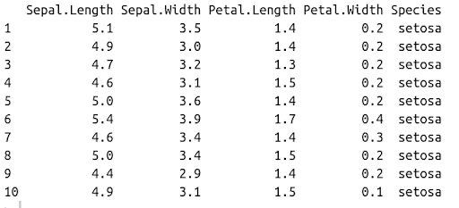

## Módulo 3: Objetos de R (estructuras de datos)

### Contenido
3.1. [Introducción](#introduccion) <br>
3.2. [Vectores](#vectores) <br>
3.3. [Matrices](#matrices) <br>
3.4. [Listas](#listas) <br>
3.5. [Dataframes](#dataframes)<br>

#### 3.1. Introducción <a name="introduccion"></a>
Las colecciones de datos surgen de la necesidad de manipular datos agrupados con fines específicos.

Cuando se tiene una colección, las operaciones básicas que se requieren hacer son:

  - agregar un dato
  - eliminar un dato
  - buscar un dato
  - actualizar un dato
  - conocer la cantidad de datos almacenados
  
##
**R** tiene varias formas de representar a esas colecciones y van a depender de la manera interna de cómo se almacenan y de cómo se acceden a ellas.

Entre ellas encontramos:

 - vectores
 - matrices
 - arrays
 - listas
 - data frames

#### 3.2 Vectores <a name="vectores"></a>
Un vector es una colección de uno o más datos del mismo tipo (es la estructura más sencilla que tiene **R**).

### Características:

- Homogéneo. Un vector tiene el mismo tipo que los datos que contiene.
El tipo del vector lo define su contenido (Si tenemos un vector que contiene datos de tipo numérico, el vector será también de tipo numérico)

- Tamaño. Es el número de elementos que contiene el vector (**length()**)

- Atributos. Los vectores tienen varios atributos que describen características de los datos que contienen.

##
### Ejemplos con vectores
En **R** los datos simples se definen como vectores, por ejemplo un entero *8* es un vector de longitud 1.

```r
8
## [1] 8
```

### La función **is.vector()**
```r
is.vector(8)
[1] TRUE
```

### La función **length()**
```r
length(8)
[1] TRUE
```

## 
### Ejemplos de vectores con cadenas y variables lógicas

```r
is.vector("ocho")
## [1] TRUE
length("ocho")
[1] 1

is.vector(TRUE)
## [1] TRUE
length(TRUE)
[1] 1
```

### Creando vectores

Para crear un vector usamos la función *c()* (combinar), la cual recibe como argumento los elementos agregar, separados por comas.

```r
# Vector numérico
c(15, 4, 0, 5, 8, 13)
[1] 15  4  0  5  8 13

# Vector de cadenas
c("mujer", "hombre", "adolescente")
[1] "mujer"       "hombre"      "adolescente"

# Vector lógico
c(TRUE, TRUE, FALSE, FALSE, TRUE)
[1]  TRUE  TRUE FALSE FALSE  TRUE
```

##
### Agregando elementos al vector
Si deseamos agregar un elemento a un vector, se logra combinando el vector original con los elementos nuevos y asignando el resultado al vector original.

```r
vector <- c(TRUE, FALSE, TRUE)
vector <- c(vector, FALSE)
vector
[1]  TRUE FALSE  TRUE FALSE
```

## 
### Uniendo dos vectores
Se pueden crear vectores uniendo vectores:

```r
mi_vector_1 <- c(20, 21, 22)
mi_vector_2 <- c(23, 24, 25)

mi_vector_3 <- c(mi_vector_1, mi_vector_2)
mi_vector_3

[1] 20 21 22 23 24 25
```

## 
### Combinando diferentes tipos de datos en un vector
Cuando se usan diferentes tipos de datos en un vector, **R** realiza *coerción de tipos*, al tipo de datos más flexible.

```r
#vector numérico
v <- c(11, 12, 13)
class(v)
[1] "numeric"
```

Si agregamos un valor de cadena "hola"
```r
v_n <- c(v, "hola")
class(v_n)
[1] "character"
```

*Ejercicio: Hacer lo equivalente con otros tipos de datos*
```r
mi_vector_mezcla <- c(FALSE, 2, "tercero", 4.00)
```

## 
### Creando vectores con secuencias numéricas **:**

- en ambos lados se escribe el inicio y el final de la secuencia,
- son consecutivas
- tienen cambios de uno en uno
- incluyen límites negativos
- cifras decimales

```r
1:10 #ascendente
10:1 #decreciente
-50:-10 #negativos
80.15:90 #cifras decimales
-3.75:3 #decimales al inicio
46:50.05 #decimales al final
```

## 
### Vectorización de funciones
Consiste en aplicar una función a cada elemento dentro de un vector

```r
#Sea
vector <- c(28, 0, 1, 2, 3, 6, 7, 9, 10, 19)

#vectorizacion aritmetica
vector + 2
vector * 2
vector %% 2

#vectorizacion con operaciones relacionales
vector < 10
vector > 10
vector == 10
```

##
### Eliminando elementos del vector
```r
personaje <- c('Fernando', 'Alejandro', 'Moisés', 'Agustino', 'Ezequiel')
personaje[-c(2, 5)] 
#elimina las posiciones:(2,5), entonces elimina a "Alejandro" y "Ezequiel", 
#entonces es algo como leerlo "- la 2 y la 5"
```

### Posibles respuestas al calculo de la media aritmética

Usando la función *mean* podemos calcular la media aritmética de las calificaciones del estudiante:

```r
x <- c(2, 4, 3, 6, 3, 7, 5, 8)
mean(x) # 4.75
# Equivalente a:
sum(x)/lenght(x) # 4.75
```

#### 3.3 Matrices <a name="matrices"></a>
Es un tipo especial de vector que tiene una dimensión más, logrando una forma rectangular y controlada por renglones y columnas.

Para crear matrices se usa la función *matrix()*

- Una forma es que reciba como argumento un vector
```r
matrix(1:15) # genera una matriz de una columna
```

##
- Otra forma es que reciba tres parámetros:
```r
# Tres renglones y cuatro columnas
matrix(1:15, nrow = 3, ncol = 4)
# Cuatro renglones y tres columnas
matrix(1:12, nrow = 4, ncol = 3)
```

## 
### Funciones para unir vectores en la matriz, por columnas y por renglón

    cbind() para unir vectores, usando cada uno como una columna.
    rbind() para unir vectores, usando cada uno como un renglón.

```r
vector_1 <- 1:4
vector_2 <- 5:8
vector_3 <- 9:12
vector_4 <- 13:16
matriz <- rbind(vector_1, vector_2, vector_3, vector_4)
```

## 
### Acceder a un elemento de la matriz: matriz[ren, col]
```r
x <- matriz[1, 2]
x
```

### Obtener todo el renglón
```r
ren <- matriz[noRen,]
```

### Obtener todo la columna
```r
col <- matriz[,noCol]
```

##
### Para saber el tamaño de la matrix, se usa **dim**
```r
dim(matriz)
```

### Funciones algebraicas con matrices
```r
diag( matriz ) # la diagonal de una matriz
t( matriz ) # la transpuesta de una matriz
det( matriz) # el determinante de un matriz, marca error si no es cuadrada
solve( matriz ) # la inversa de la matriz
eigen( matriz ) # los eigen valores y los eigen vectores de una matriz
A %*% B #la multiplicacion de matrices, sólo se pone el signo de %
```

#### 3.4 Listas <a name="listas"></a>
- Una lista es un objeto que contiene una colección ordenada de objetos.
- Los componentes no necesitan ser del mismo tipo

Ejemplo:
```r
lst1 <- list("Fred", "Mary", 3, c(4,7,9))
lst <- list(name="Alex", wife="Mary", noChildren=3, childAges=c(4,7,9) )
```

## Características de las listas
- Como los componentes están enumerados, entonces se pueden acceder por su posición
```r
lst[[indice]] con indice={1,2,3,4}
```

- Note que lst[[4]] es un **vector**, por lo que para acceder a sus componentes se usa:
```r
lst[[4]][1]
```

- Si lst es una lista, entonces tiene el atributo **length**
```r
class(lst)
length(lst)
```

##
- Los componentes de la lista también pueden ser nombrados y entonces el elemento se puede acceder
con el nombre en lugar de usar el número, la expresión es de la forma:
```r
nombreDeLaLista$nombreDelComponente
```

Ejemplo:
```r
lst$name es lo mismo que lst[[1]] y es la cadena "Alex",
lst$wife es lo mismo que lst[[2]] y es la cadena "Mary",
lst$childAges[1] es lo mismo que lst[[4]][1] y es el número 4.
```

##
### Concatenando listas
Se usa la función **c()** y si los argumentos son listas, el resultado es un objeto lista.
```r
list.ABC <- c(list.A, list.B, list.C)
```

#### 3.5 Dataframe (marco de datos) <a name="dataframes"></a>

- Un data frame es mas general que una matriz, esta estructura permite que diferentes 
columnas contengan distintos tipos de datos: numérico, cáracter, lógicos y otros.
- Un data frame es una estructura rectangular, en el sentido de que las columnas deben ser de
la misma longitud.
- Las columnas representan variables y los renglones son observaciones.
- Otra característica es que las **columnas** deben tener nombres y ser del mismo tipo
- Un data frame como se aclara más adelante puede pensarse como una "lista", donde los elementos
son vectores (o factores) correspondientes a las columnas.

##
Ejemplo: 

El conjunto Iris que viene preinstalado en todos los paquetes de R.

 

##
### Funciones para mostrar primeros y últimos registros del dataframe

Ejemplo:
```r
iris
View(iris)
head(iris)
help(head)
head(iris, n=10)
tail(iris)
```

También existen conjuntos de datos que muestran resultados de análisis
```r
Titanic
```

### Función str
Si queremos conocer la estructura global de un data frame, se usa la función **dataframe**

```r
str(d.f)
#> 'data.frame':    150 obs. of  5 variables:
#>  $ Sepal.Length: num  5.1 4.9 4.7 4.6 5 5.4 4.6 5 4.4 4.9 ...
#>  $ Sepal.Width : num  3.5 3 3.2 3.1 3.6 3.9 3.4 3.4 2.9 3.1 ...
#>  $ Petal.Length: num  1.4 1.4 1.3 1.5 1.4 1.7 1.4 1.5 1.4 1.5 ...
#>  $ Petal.Width : num  0.2 0.2 0.2 0.2 0.2 0.4 0.3 0.2 0.2 0.1 ...
#>  $ Species     : Factor w/ 3 levels "setosa","versicolor",..: 1 1 1 1 1 1 1 1 1 1 ...
```

##
### Más características del dataframe
- La estructura de un dataframe es muy similar a la de una matriz. La diferencia es que sus filas pueden contener valores de diferentes tipos de datos.

- Los dataframe también tienen similitud con las listas, puesto que son básicamente colecciones de elementos. Sin embargo, el dataframe es una lista que únicamente contiene vectores de la misma longitud.

- Cada columna es considerada un vector

##
### Creando dataframes
Creamos vectores con los valores
```r
nombre <- c("Juan", "Margarita", "Ruben", "Daniel")
apellido <- c("Sanchez", "Garcia", "Sancho", "Alfara")
fecha_nacimiento <- c("1976-06-14", "1974-05-07", "1958-12-25", "1983-09-19")
sexo <- c("HOMBRE", "MUJER", "HOMBRE", "HOMBRE")
nro_hijos <- c(1, 2, 3, 4)
```

# Creamos un dataframe usando la función **data.frame()**
```r
censo <- data.frame(nombre, apellido, fecha_nacimiento, sexo, nro_hijos)
censo
```

## 
### Los atributos del marco de datos
- Con **dim** conocemos la dimensión del marco de datos 
```r
dim (censo)
```

- El número de filas 
```r
dim(censo)[1]
nrow(censo)
```

- El número de columnas
```r
dim(censo)[2]
ncol(censo) #<--- es la forma más recomendada por ser más intuitiva
length(censo)
```

##
### Los nombres en el marco de datos
Cuentan con un atributo llamado **names**, los nombres de las columnas
```r
names(censo)
```

### Para cambiar los nombres, podemos hacer uso de la función names():
```r
# Asignamos diferentes nombres a las columas de `censo`
names(censo) <- c("Nombre", "Apellido", "Fecha_Nacimiento", "Sexo", "Numero_Hijos")
names(censo)
```

##
### Las funciones rownames() y colnames()
Para cambiar los nombres de las filas y columnas
```r
colnames(censo) <- c("Nombre", "Apellido", "Fecha_Nacimiento", "Sexo", "Numero_Hijos")
rownames(censo) <- c("ID1", "ID2", "ID3", "ID4")
censo
```

### Seleccionando elementos específicos

#### Acceder a todo un registro (renglón)
Los datos que más interesan de manera inicial es traer todo un registro(renglón)

```r
censo[2, ] # todo el registro número 2
censo[2:4, ] # del registro 2 al 4. 
```

#### Acceso a las columnas
```r
censo[, 2] #una sola columna
censo[, 1:3] #un recorte de la columna 1 a la 3
```

#### Hacer un recorte de renglones y columnas
```r
censo[1:5, 1:3] ##del renglón 1 al 5, de la columna 1 a la 3
```

o por su nombre, usando el nombre de la columna
```r
censo$Nombre
censo[, "Nombre"]
censo[["Nombre"]]
```

#### Recorte del dataframe por selecciones
Son subtablas con registros (renglones) que cumplan ciertas condiciones.<br>

Para ver mejor los resultados de las siguientes operaciones, vamos a meter más registros a nuestros datos
```r
censo <- rbind(censo, c("Mirna", 
                        "Tapia", 
                        "1990-02-12", 
                        "MUJER", 
                        0))
censo <- rbind(censo, c("Ameyalli", 
                        "Flores", 
                        "1988-03-25", 
                        "MUJER", 
                        0))
censo <- rbind(censo, c("Roxana", 
                        "Vera", 
                        "1985-08-03", 
                        "MUJER", 
                        0))
censo <- rbind(censo, c("Clara", 
                        "Mejia", 
                        "1960-07-22", 
                        "MUJER", 
                        0))
censo
```

```r
#La subtabla formada por las filas correspondientes a personas con sexo = "MUJER" cuyo número de hijos es 0.
censo[censo$Sexo == "MUJER" & censo$Numero_Hijos == 0, ]

#censo[censo$Sexo == "MUJER" & censo$Numero_Hijos == 0, ][2:5, ]# y hacer más combinaciones
```

##
### Vectorización de un dataframe

De igual manera que con un vector y con una matriz, si aplicamos una operación básica
al marco de datos, esta se vectorizará, marcando error cuando lo amerite o haciendo coersión, según los datos. <br>

Primero lo haremos con un dataframe simple.
```r
hijos <- c(1, 2, 3, 4)
edades <-c(20, 35, 32, 51)
pruebaVectorizacion <- data.frame(hijos, edades)
pruebaVectorizacion
pruebaVectorizacion * 2
```

También marcará error cuando sea necesario, según los datos almacenados
```r
censo * 2
```

##
### Añadiendo una nueva columna al marco de datos con la función **cbind()**
```r
censo <- cbind(censo, direccion = c("Col.Portales","Col. El Retoño", "Col. Roma Sur", "Col. Santa Fe"))
```

### Otra forma de hacer lo equivalente
```r
censo$correoElectronico <- c( "juan@correo.com",
                              "margarita@correo.com",
                              "ruben@correo.com",
                              "daniel@correo.com",
                              "mirna@correo.com",
                              "ameyalli@correo.com",
                              "roxana@correo.com",
                              "clara@correo.com")
censo
```

##
### Otro ejemplo de añadiendo columnas
Nota: volver a revisar vectorización (en vectores y matrices).

```r
censo$TieneHijos <- censo$NumeroHijos > 0
censo
```

##
### Añadiendo renglones (registros)
- Una forma es usando la posición del dataframe
```r
censo[ nrow(censo) + 1,] = c("Juan", "Guevara", "1990-08-03", "MUJER", 2, "Col. Del Valle", "juan@correo.com", TRUE)
censo
```

- Otra manera es usando la función **rbind**
```r
censo <- rbind(censo, c("Raul", "Hidalgo", "1986-04-09", "HOMBRE", 0, "Col. Del Valle", "raul@correo.com", FALSE))
```

- Una más es agregando los registros de otro dataframe al nuestro
Ejercicio:
```r
df3 <- rbind (df1, df2)
df3
```

> [!NOTE]
> Ver los primeros ejercicios de dataframe

## Valores olvidados-perdidos NA y NULL
**NA** se refiere a datos perdidos, es decir, que pudieron olvidarse de introducir u obtener
**NULL** se refiere a datos no-existentes, resultado de valores u objetos que no existen 
```r
temp  <- c(7.2, NA, 7.1, 6.9, 6.5, 5.8, 5.8, 5.5, NA, 5.5)
temp
```

- qué pasaría si quisiéramos hacer la suma de las temperaturas?
```r
sum(temp)
sum(temp, na.rm=TRUE)
```

##
### Filtrando registros de un dataframe
```r
censo <- censo[censo$nombre != 'Juan',]
censo
```

##
### Ordenando marco de datos por columna **order, sort**
  - **order** funciona en relación a vectores juntos, sort es más para vectores individuales
  - decreasing = {TRUE, FALSE}
  - si se ordena con elementos NA, estos van aparecer al final de la secuencia
 
Una prueba con valores NA
```r
edad <- c(43, NA, 49, NA,34,56,78)
censo <- cbind(censo, edad)
censo[order(censo$edad),]
```

##
Cuál es la diferencia entre estas dos funciones?
```r
edades  <- c(7, NA, 7, 6, 6, 5, 5, 5, NA, 5)
sort(edades)
order(edades)
```

## 
Generalmente cuando tenemos estructuras de datos más complejas, usaremos **order**
```r
censo[order(censo$Nombre),]
censo[order(censo$Nombre, decreasing = TRUE),]
censo[order(censo$Nombre, decreasing = FALSE),]

censoOrdenado <- censo[order(censo$Nombre), ]
censoOrdenado
```

### La ventaja de la funcion order, es que permite ordenar por varias columnas
```r
censoOrdenado <- censo[order(censo$direccion, censo$edad), ]
censoOrdenado
```

##
### Mezclando (**merge**) dos marcos de datos por **un campo común**
- la función que mezcla se llama **merge**
- cómo funciona?
- qué pasa si **el campo común** no encuentra una coincidencia?
```r
datosHabitacion <- data.frame("Nombre" = c("Juan", "Margarita", "Ruben", "Daniel"), 
                              "tipHab" = c("casa", "depto", "depto", "casa"), 
                              "noFocos"= c(20,8,12,32),
                              "habPropia" = c(TRUE, TRUE, FALSE, TRUE))
nuevosDatos <- merge( censo, datosHabitacion)
nuevosDatos
```

##
### El tipo de dato con **class()**
```r
class(datosHabitacion)
```

##
### Más funciones para el marco de datos

- Funciones para manipular objetos tipo Fecha
```r
fecha_nacimiento <- as.Date(c("1976-06-14", "1974-05-07", "1958-12-25", "1983-09-19"))
```

### Borrando columnas en el dataframe con !(names(dataframe) %in% vector)
```r
id <- c(1,2,3,4,5,6,7,8,9)
valor <- c(7,1,12,4,5,16,71,38,19)
categoria <- c(rep("bajo",3),rep("medio",3),rep("alto",3))
color <- c(rep("rojo",1),rep("azul",2),
           rep("naranja",2),rep("morado",1),
           rep("amarillo",2),rep("verde",1))

datos <- data.frame(id=id, valor=valor, categoria=categoria,color=color)

head(datos, n=9)

# Eliminar columnas de un dataframe
borrar <- c("valor","categoria")
datos2 <- datos[ , !(names(datos) %in% borrar)]
head(datos2, n=9)
```
