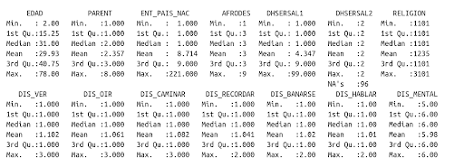

## Módulo6. Introducción a la estadística y probabilidad con R

### 6.1 Conociendo el tipo de datos que tenemos en nuestro dataframe
Conocer el tipo de datos de nuestro marco de datos (o la estructura de datos que estemos trabajando) es importante pues eso nos permitirá saber qué análisis
se puede realizar sobre ella, pues están determinadas si el dato representa relaciones cualitativas o cuantitativas.

Una manera de saberlo es con la función **class**, pero quisiéramos aplicarlo de manera automática a todas las columnas.

#### La función lapply
<pre><code>
Sintáxis: apply( x, funcion ) #aplicado de esta manera es para columnas
Regresa: una lista con el tipo de dato para cada columna
</code></pre>

Usaremos la función **lapply**.
<pre><code>
lapply(datosInegiConMunicipiosOrdenado, class)
</code></pre>

### 6.2 Obteniendo un resumen de los datos
Y por último, pedimos un resumen de nuestros datos con la función **summary()**. Esta función acepta cualquier tipo de objeto como argumento y nos devuelve un resumen descriptivo de los datos de cada uno de sus elementos.

<pre><code>
summary(datosInegiConMunicipiosOrdenado)
</code></pre>

 
