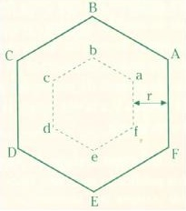
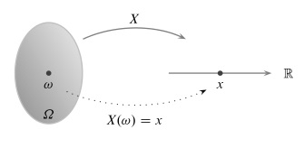

## Módulo6. Introducción a la estadística y probabilidad

### Perspectiva histórica-filosófica

 

### Tipos de Probabilidad

### a) clásica 

    P(A) = casos favorables/casos posibles 

### b) empírica, frecuentista, estadística

  Tiene que ver con cierta inducción y con las frecuencias que vamos observando 

 

Usualmente se denota $n(A)$ el número de ocurrencias del evento $A$, en $n$ realizaciones del experimento:

$$ P(A) =  \lim_{n \to \infty} \frac{n(A)}{n}$$

## c) geométrica 

    P(A) = hex.chico/hex.gde. 

 

### d) axiomática

Formulada por A. N. Kolmogorov ( ~ 1933) 

  a) *espacio muestral* (sucesos elementales), $\Omega$ 

  b) colección de *sucesos* o *eventos*

  c) a cada *evento* $A$ se le asigna un número $P(A)$ que satisface 3 axiomas: 

  axioma 1.  $0 \leq P(A) \leq 1$
  
  axioma 2.   Si $A_1, A_2$ son sucesos disjuntos, entonces $P(A_1 \cup  A_2) = P(A_1) + P(A_2)$
  
  axioma 3. $P(\Omega) = 1$
  
  
#### Observaciones

    - el espacio muestral no es único, depende de lo que requiera el observador.
    - La formulación axiomatica no dice cómo asignar probabilidades. 
    - La formulación se puede hacer más abstracta, empleando objetos tales como con sigmas álgebras y espacios de Borel, conexiones con la teoría de la medida, etc.
    -  Se hace en términos de la teoría de conjuntos: unión, intersección, vacío, complemento, etc.

#### Uso de los diagramas de Venn

 

### CASO DISCRETO Y CASO CONTINUO

#### a. un dado *justo*

 

Se puede ver que si $p(A)=$*p(cara del dado)* es probabilidad, cumple los 3 axiomas: 

  - cada número asignado es menor que 1
  - cada evento es exclusivo: sólo sale un resultado
  - la suma total es 1.

O en notación:

$0 \leq p(A) \leq 1$

Si $A_1, A_2$ son 2 caras distintas, i.e. $A_1 \neq A_2$,  $P(A_1 \cup  A_2) = P(A_1) + P(A_2)$

$\Sigma p(A) = 1$

Está asociado a la simetría del cubo; eso no siempre se tiene.

Los *sucesos elementales* a veces se les nombra microestados.

#### b. dos dados 

 

Otra forma de visualizarlos; ya sugiere un histograma: 

 

  - Demanda *saber contar*, lo que lleva a los problemas de combinatoria.  

### 2. caso continuo

Se hace una transformación del espacio de resultados $\Omega$, al conjunto de números reales; que se conoce como variable aleatoria o v.a. $X$.

 

De ahí se puede construir una *función de probabilidad* (o *densidad de probabilidad*) de $X$ en un intervalo apropiado $I$ con 

$$P( X \in I) = \int_I f(x)dx  $$

 

Aquí la asignación se hace de manera que para la función $f(x)$, 
sobre un intervalo adecuado $I$, se cumpla para toda $x \in I$

 $$0 \leq f(x) $$

  $$\int_I  f(x) = 1$$

Como se ve, requiere hacer uso del cálculo integral.

#### Distribuciones

 

Se busca calcular medidas de tendencia central (media, moda, mediana), y otros parámetros que indiquen la forma de la distribución (desviación estándar, varianza, curtosis), y regiones de interés (quantiles).

#### Estadística
Partiendo de los datos (la estadística), extraer información que se cosnidere relevante:

  - demanda poder manipular los datos
  - ordenarlos
  - visualizarlos (histogramas, gráficas, etc.)
  - problemas de la inferencia: validación, etc.

## Referencias

  * Haken, H. 1983. *Synergetics. An Introduction.* Berlin: Springer Verlag. 
  * Hamming, R. W. 1991. *The art of probability for scientists and engineers.* Addison-Wesley Publ.
  * Rincón, L. 2013. *Curso elemental de probabilidad y estadística.* México: UNAM, Instituto de Matemáticas/Sociedad Matemática Mexicana.
 Disponible en: https://lya.fciencias.unam.mx/lars/indexL.html 
 * Rincón, L. 2011. *Curso intermedio de probabilidad.* México: UNAM, Facultad de Ciencias. Disponible en: https://lya.fciencias.unam.mx/lars/indexL.html
  * Spanos, A. 2003. *Probability Theory and Statistical Inference: Econometric Modeling with Observational Data.*
Cambridge University Press. 

