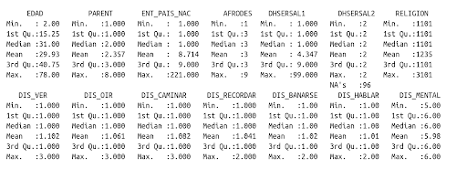

## 7. Graficando datos estadísticos con R (ggplot2)
“Un simple gráfico ha brindado más información a la mente del analista de datos que cualquier otro dispositivo”. — John Tukey

### 7.1 Conociendo el tipo de datos que tenemos en nuestro dataframe
Conocer el tipo de datos de nuestro marco de datos (o la estructura de datos que estemos trabajando) es importante pues eso nos permitirá saber qué análisis se puede realizar sobre ella, ya que las operaciones están determinadas por si la columna representa relaciones cualitativas o cuantitativas.

Una manera de saberlo es con la función **class**, la cuál quisiéramos aplicar de manera automática a todas las columnas.

#### La función lapply
 ```r
Sintáxis: apply( x, funcion ) #aplicado de esta manera es para columnas
Regresa: una lista con el tipo de dato para cada columna
 ```
Ejemplo **lapply**.
 ```r
lapply(datosInegiConMunicipiosOrdenado, class)
 ```

### 7.2 Obteniendo un resumen de los datos
Y por último, pedimos un resumen de nuestros datos con la función **summary()**. Esta función acepta cualquier tipo de objeto como argumento y nos devuelve un resumen descriptivo de los datos de cada uno de sus elementos.

 ```r
summary(datosInegiConMunicipiosOrdenado)
 ```

 

La salida muestra:
- mínimos y máximos en busca de valores atípicos (outliers), 
- si la media y mediana son similares la una a la otra.

También se puede realizar el resumen por columna
 ```r
summary(datosInegiConMunicipiosOrdenado$EDAD)
 ```

### 7.3 Variables discretas en R

#### Frecuencias absolutas con la función **table**
Recibe un vector o una lista

Ejemplo:
 ```r
table(datosInegiConMunicipiosOrdenado$NOM_ENT)
 ```

#### Frecuencias relativas (proporciones) con la función **prop.table()**
Ejemplo:
 ```r
prop.table(table(datosInegiConMunicipiosOrdenado$NOM_ENT))
 ```

### 7.4 Histogramas

#### usando la función ggplot
1. Creamos la variable **pl** correspondiente a la sintaxis básica en el paquete **ggplot2** para la creación de una gráfica.

 ```r
install.packages("ggplot2")
library(ggplot2)
colnames(datosInegiConMunicipiosOrdenado)
head(datosInegiConMunicipiosOrdenado)
pl <- ggplot(datosInegiConMunicipiosOrdenado, aes(x = EDAD))
class(pl)
 ```

2. Añadimos el elemento geométrico, en este caso, queremos un histograma.
 ```r
pl + geom_histogram()
 ```

3. Mejoramos la visualización agregando más parámetros a la función *geom_histogram()*
 ```r
pl2 <- pl + geom_histogram(binwidth = 0.8, #ancho de la barra 
                                    col='black', #contorno de la barra
                                    fill='green', #relleno de cada barra
                                    alpha=0.4) #transparencia del color
pl2
 ```

4. Agregamos una capa más de etiquetas.
 ```r
pl2 + labs( title = "CENSO",
            x = "Columna Edad",
            y = "Conteos",
            subtitle = "Edad")
 ```

#### Dibujando la gráfica de otra manera
Otra manera de rellenar las barras del histograma en función del número de apariciones es usando **..count..** en los aesthetics de **geom_histogram()**
 ```r
pl2 <- pl + geom_histogram(binwidth = 0.8, #ancho de la barra 
                           aes(fill=..count..),
                           col="black") #transparencia del color
 ```

### Histogramas por grupos

Ejemplo simple:
 ```r
set.seed(3)
x1 <- rnorm(500)
x2 <- rnorm(500, mean = 3)
x <- c(x1, x2)
grupo <- c(rep("G1", 500), rep("G2", 500))

df <- data.frame(x, group = grupo)
 ```

 ```r
ggplot(df, aes(x = x, fill = grupo)) + 
  geom_histogram()
 ```

Ejemplo con datos del INEGI
 ```r
df <- data.frame(datosInegiConMunicipiosOrdenado, 
                 group = datosInegiConMunicipiosOrdenado$NOM_ENT)
ggplot(df, aes(x = datosInegiConMunicipiosOrdenado$EDAD, 
               fill = datosInegiConMunicipiosOrdenado$NOM_ENT)) + 
  geom_histogram()
 ```

> [!note]
> Realizar el Ejercicio 1
> [!note]
> A partir de este punto, los códigos dependen de la ejecución del Ejercicio 1

### Personalizando la gráfica
Con este paquete se puede personalizar a gran detalle cada una de las gráficas, en esta sección vamos a explorar algunas de las opciones disponibles.

#### Modificando los colores

##### Personalizando el color del borde

Si estableces **fill** dentro de **aes** pero no **colour** puedes cambiar el color del borde para todos los histogramas así como el ancho y tipo de línea con los argumentos de **geom_histogram**.

 ```r
ggplot(df, aes(x = datosInegiConMunicipiosOrdenado$EDAD, 
               fill = datosInegiConMunicipiosOrdenado$NOM_ENT)) + 
           geom_histogram(colour = "black",
                          lwd = 0.75, #line width
                          linetype = 1,
                          position = "identity")
 ```

##### Personalizando el color de fondo
Si estableces **colour** pero no **fill** puedes cambiar el color de fondo de todos los histogramas con el argumento **fill** de **geom_histogram**.

 ```r
ggplot(df, aes(x = datosInegiConMunicipiosOrdenado$EDAD, 
               colour = datosInegiConMunicipiosOrdenado$SEXO_CHAR)) + 
  geom_histogram(fill  = "white",
                 position = "identity")
 ```
> [!note]
> Asegurarse que el argumento activo de **aes** es **colour**
> 
##### Personalizando el color del borde para cada grupo

El color de los bordes se puede personalizar para cada histograma con **scale_color_manual**. Si quieres usar una paleta predefinina puedes usar, por ejemplo, **scale_color_brewer**.

 ```r
 geom_histogram(fill  = "white",
                 position = "identity") +
  scale_color_manual(values = c("blue", "orange"))
 ```

##### Personalizando el color de fondo para cada grupo
De manera similar a personalizar los colores de los bordes, los colores de fondo se pueden cambiar con **scale_fill_manual** o una función equivalente.
 ```r
ggplot(df, aes(x = datosInegiConMunicipiosOrdenado$EDAD, 
               fill = datosInegiConMunicipiosOrdenado$SEXO_CHAR)) +
geom_histogram(color = 1, alpha = 0.75,
                 position = "identity") +
 scale_fill_manual(values = c("#8795E8", "#FF6AD5"))
 ```
Nota: Asegurarse que el campo activo para **aes** es **fill**

#### Colores predefinidos en R

Existen diferentes formas de especificar un color en R: 
- Usando números del 1 al 8, e.g. col = 1 
- Especificando el nombre del color, e.g. col = "blue" 
- El valor HEX del color, e.g. col = "#0000FF"
- El valor RGB, haciendo uso de la función rgb, e.g. col = rgb(0, 0, 1). Esta última función también te permitirá cambiar la transparencia del color en caso de ser necesario, con el argumento alpha, que toma valores desde 0 (completamente transparente) hasta 1.

https://r-charts.com/es/colores/

#### Modificando los parámetros a la función geom_histogram()

- alpha = [0,1]. La transparencia del color
- position = {"stack", "identity", "dodge"}. Posición de las barras
- binwidth. Ancho de las barras

NOTA: Probar una por una, para notar los cambios, para diferentes parámetros de cada argumento

 ```r
geom_histogram(alpha = 0.5, position = "identity")
#geom_histogram(alpha = 0.5, position="identity", binwidth = 1.5 ) #Ejemplo para probar
#geom_histogram(alpha = 0.5, position = "dodge") #Ejemplo para probar
 ```

#### La leyenda de los valores categóricos (por grupos)
El título de la leyenda es el nombre de la columna de la variable categórica del conjunto de datos. Puedes cambiarlo con los argumentos **fill** y/o **colour** de la función **guides**. 
 ```r
df +guides(fill = guide_legend(title = "Por Municipio"),
         colour = guide_legend(title = "Por Municipio"))
 ```

#### Posición de la leyenda
La posición por defecto de la leyenda es la derecha, pero puedes cambiarla con el argumento **legend.position** de la función **theme**. 
La modificación de estos componentes en la gráfica se puede realizar a mucho detalle, que vale la pena revisar el **help**.<br>

Los argumentos válidos son:
- "none" 
- "left" 
- "right" 
- "bottom" 
- "top"

Ejemplo:
 ```r
+ theme(legend.position = "left")
 ```

###

