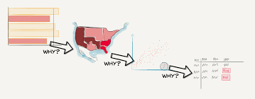
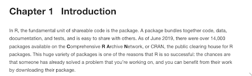
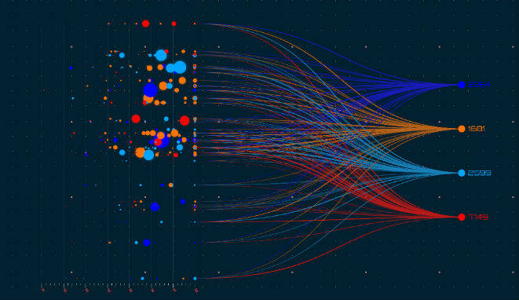
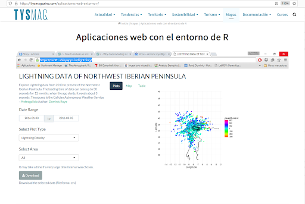
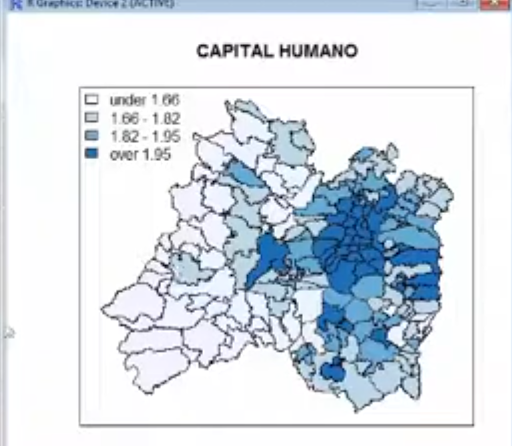
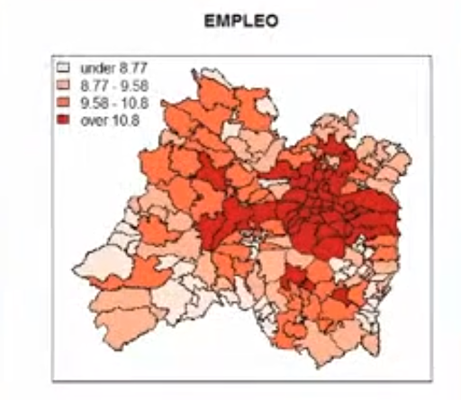

```{r setup, include=FALSE}
knitr::opts_chunk$set(echo = FALSE)
```
## Motivación para tomar un curso de análisis de datos

Desde hace muchos años la interacción continua con dispositivos electrónicos ha ocasionado la generación constante de datos.
<TABLE style="margin: 0 auto;">
    <TR>
    <TD> 
       
    </TD>
    <TD> 
       
    </TD>
    </TR>
</TABLE>

<div>
<p style = 'text-align:center;'>

</p>
</div> 

##  

Esa iteracción constante genera muchos datos que guardan información “oculta”
<TABLE style="margin: 0 auto;">
    <TR>
    <TD> 
       
    </TD>
    <TD> 
       
    </TD>
    </TR>
</TABLE>

<div>
<p style = 'text-align:center;'>

</p>
</div> 

##

Las técnicas usadas para “descubrir” esa información varían:

- métodos estadísticos convencionales
- minería de datos
- redes, redes neuronales, redes semánticas, árboles de decisión
- big data, datawarehousing
- geolocalización

##

El análisis de datos casi siempre requiere aplicar más de una técnica. 
\  

Si usaramos alguna aplicación, al ser cada una de ellas de propósito específico, tendríamos que aprender casi tantas aplicaciones como técnicas a aplicar.
\  

Si además usamos software privado, tendríamos que comprar las licencias para cada uno.

##

Aprender un lenguaje de programación de propósito general nos permitirá conocer la sintaxis del lenguaje.

\  

Acostumbrar a nuestra mente a pensar de la manera que el lenguaje estructura la solución a problemas.

\  

Y sobretodo tener acceso a los diversos paquetes desarrollados para el lenguaje.

## Motivación para tomar un curso de R

- R es un lenguaje de programación de propósito específico, está más enfocado a modelos estadísticos y gráficos (*R Core Team and the R Foundation for Statistical Computing*), pero con el paso del tiempo parece que se convertirá en lenguaje de propósito general.
- R es usado entre gente que hace minería de datos, bioinformáticos, estadísticos, y desarrolladores de aplicaciones estadísticas, entre otros.
- R es uno de los lenguajes más populares en el manejo de minería de datos (en el 2020 según el índice TIOBE).
- R es un entorno de software libre (*licencia GNU GLP*)  e independiente de plataforma.

##

### Paquetes en R  

_Un paquete (package) es una colección de funciones, datos y código R que se almacenan en una carpeta conforme a una estructura bien definida, fácilmente accesible para R._
 
Los paquetes los podemos encontrar en: <https://r-pkgs.org/>

<TABLE style="margin: 0 auto;">
    <TR>
    <TD> 
       
    </TD>
    <TD> 
       
    </TD>
    </TR>
</TABLE>
 
## Objetivo del curso de R

\  

Los asistentes aprenderán los principales conceptos del lenguaje de programación
R y adquirirán las habilidades y las herramientas básicas para el análisis de datos.

## Los contenidos del curso de una manera general

- La instalación e iteracción con el entorno de desarrollo de R y RStudio
- Conociendo las variables y las funciones en R
- Manipulando datos en la memoria interna, a través de vectores, matrices, listas, dataframes
- Manipulando datos en la memoria externa (archivos), importando archivos y exportando archivos y luego su posterior edición
- Introducción a la estadística y probabilidad con R
- Graficando datos con R (ggplot2)
- Estructuras de control básicas
- Análisis con datos reales (INEGI, BM, ONU, etc)

## Las habilidades que van a adquirir los participantes

Al finalizar el curso los alumnos serán capaces de identificar las principales
características de R y sus distintos usos. 

\  

Así como también, serán capaces de manipular, editar y realizar análisis básicos de datos de forma gráfica y estadística. 

\  

Finalmente, los asistentes tendrán un acercamiento a los principales ciclos de programación para automatizar algunas tareas.

## Aplicaciones en el mercado laboral o académico

### Big Data

Con resultados tipo informes que incluye gráficos de alta calidad (<https://github.com/RevolutionAnalytics/RHadoop>, **RODBC, biglm, ff, bigmemory, snow**, paquetes para computacion en paralelo o accesos a bases de datos con **RSQLite**)

<div>
<p style = 'text-align:center;'>

</p>
</div> 

##

### Mapas

Con aplicaciones web y servidores para las aplicaciones. (**shiny** desarrollada por RStudio <https://shiny.rstudio.com/>)

<div>
<p style = 'text-align:center;'>

</p>
</div> 

## 

### Econometría en R

- modelos de regresión, diagramas de dispersión, histogramas de densidades, funciones de densidad kernel, etc
- distribución de datos en gráficas de cajas donde las cajas muestren los umbrales para cuartiles inferior y superior, además de la mediana (__boxplot__) 
- econometría espacial. Análisis de correlacion espacial local (LISA en la zona centro de México) con sistemas de información geográfica en R (__maptools, spdep, RColorBrewer, classInt__) [Ref. Econometría con software libre FES Acatlán, UNAM] 

<TABLE style="margin: 0 auto;">
    <TR>
    <TD> 
       
    </TD>
    <TD> 
       
    </TD>
    </TR>
</TABLE>
